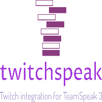

  

### twitchspeak by devusSs 🚀

Twitchspeak is an http and oauth based integration tool to combine [TeamSpeak 3](https://teamspeak.com) and [Twitch](https://twitch.tv). While there is a [Twitch](https://twitch.tv) connection setting in the [TeamSpeak 3](https://teamspeak.com) client settings I have not found any usability or purposeful usage for it.

So I designed this app for people to host it next to their [TeamSpeak 3](https://teamspeak.com) server to enable people connecting their [TeamSpeak 3](https://teamspeak.com) client with their [Twitch](https://twitch.tv) account to be able to gain certain rights or send certain commands on the [TeamSpeak 3](https://teamspeak.com) server.

It's a project in progress and has not been officially released as of December 2nd 2023.

### How do I use it?

Please refer to the [docs directory](./docs/) for further information.

### Disclaimer

This project is in no way affiliated to [Twitch](https://twitch.tv) or [TeamSpeak 3](https://teamspeak.com). This project also does not claim any rights to pictures, names or similar or code used in the project. Please check out the [go.mod](./go.mod) or [go.sum](./go.sum) files for information about the awesome packages used for building this project.

The project is also a fun / side project for me so please expect bugs and potentially problems.

### LICENSE

Licensed under [MIT License](./LICENSE)